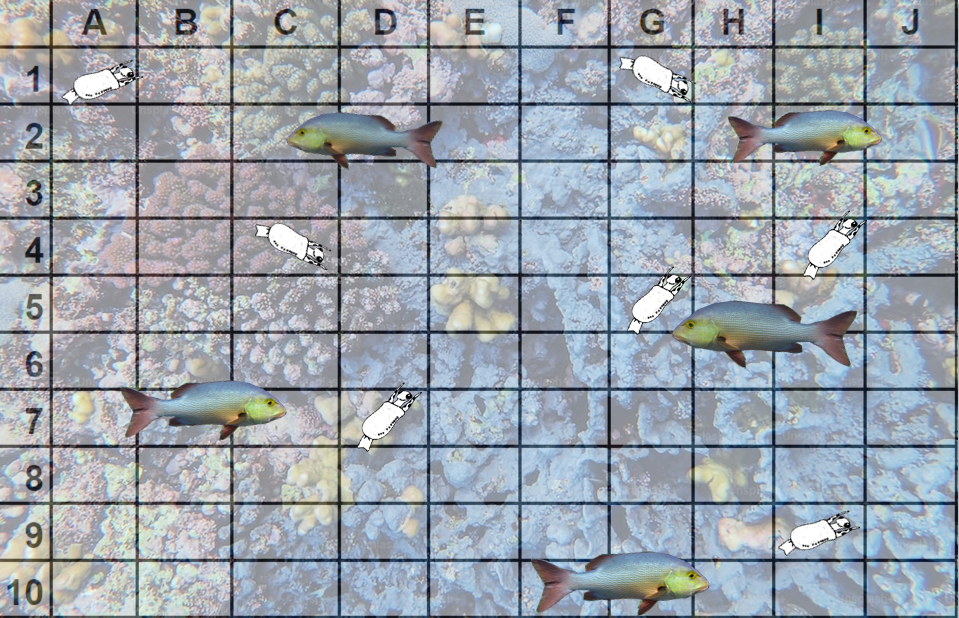

# The blade-tailed caminalcule and the shiny pollard


```{r setup, echo=FALSE}
library(shiny)

ui <- fluidPage(
  titlePanel("Caminalcule and Pollard Simulation"),
  mainPanel(
    numericInput("camiPop", "Initial Caminalcule Population (1-100):", 5, 1, 100),
    numericInput("pollPop", "Initial Pollard Population (1-75):", 5, 1, 75),
    numericInput("camiPopMultiply", "Caminalcule Population Multiplier (1-10):", 3, 1, 10),
    numericInput("numGenerations", "Number of Generations (1-100):", 30, 1, 100),
    numericInput("captureProbability", "Capture Probability (0-1):", 0.5, 0, 1, step = 0.01),
    checkboxInput("printArray", "Display Population Array After Each Generation", FALSE),
    actionButton("simulateBtn", "Simulate"),
    verbatimTextOutput("simulationOutput") # Using verbatimTextOutput to preserve newlines
  )
)

server <- function(input, output, session) {
  outputText <- eventReactive(input$simulateBtn, {
    camiPop <- isolate(input$camiPop)
    pollPop <- isolate(input$pollPop)
    camiPopMultiply <- isolate(input$camiPopMultiply)
    numGenerations <- isolate(input$numGenerations)
    captureProbability <- isolate(input$captureProbability)
    printArray <- isolate(input$printArray)
    
    results <- c(sprintf("Gen: 0 Starting Caminalcule Pop: %d Starting Pollard Pop: %d", camiPop, pollPop))
    
    for (index in 1:numGenerations) {
      found <- 0
      biome <- matrix(FALSE, nrow = 10, ncol = 10)
      
      for (cami in 1:camiPop) {
        x <- sample(1:10, 1)
        y <- sample(1:10, 1)
        
        if (!biome[x, y]) {
          biome[x, y] <- TRUE
        } else {
          while (biome[x, y]) {
            x <- sample(1:10, 1)
            y <- sample(1:10, 1)
          }
          biome[x, y] <- TRUE
        }
      }
      
      chosenXY <- matrix(FALSE, nrow = 10, ncol = 10)
      
      for (polly in 1:pollPop) {
        x <- sample(1:10, 1)
        y <- sample(1:10, 1)
        
        while (chosenXY[x, y]) {
          x <- sample(1:10, 1)
          y <- sample(1:10, 1)
        }
        
        if (biome[x, y] && !chosenXY[x, y] && runif(1) <= captureProbability) {
          camiPop <- camiPop - 1
          found <- found + 1
          chosenXY[x, y] <- TRUE
        } else {
          chosenXY[x, y] <- TRUE
        }
      }
      
      camiPop <- camiPop * camiPopMultiply
      if (camiPop < 1) camiPop <- 1
      if (camiPop > 100) camiPop <- 100
      
      lostPop <- floor(pollPop / 3)
      pollPop <- pollPop - lostPop
      pollPop <- pollPop + found + 1
      
      if (pollPop > 75) pollPop <- 75
      if (pollPop < 1) pollPop <- 1
      
      result_string <- sprintf("Gen: %d Ending Caminalcule Pop: %d Ending Pollard Pop: %d || found: %d", index, camiPop, pollPop, found)
      results <- c(results, result_string, "\n")
      if (printArray) {
        results <- c(results, printBiome(biome, chosenXY))
      }
    }
    
    results <- c(results, "Simulation ended after reaching specified number of generations.")
    return(results)
  })
  
  output$simulationOutput <- renderPrint({
    outputText()
  })
}

printBiome <- function(biome, chosenXY) {
  result <- c("Printing location array of Caminalcule locations, 1 = occupied, 0 = unoccupied, X = found")
  for (i in 1:10) {
    row <- c()
    for (j in 1:10) {
      if (biome[i, j] && !chosenXY[i, j]) {
        row <- c(row, "1")
      } else if (biome[i, j] && chosenXY[i, j]) {
        row <- c(row, "X")
      } else {
        row <- c(row, "0")
      }
    }
    result <- c(result, paste(row, collapse = "  "))  # Concatenate row elements with double space
  }
  result <- paste(result, collapse = "\n")  # Join rows with newline character
  return(result)
}

shinyApp(ui, server)
```


