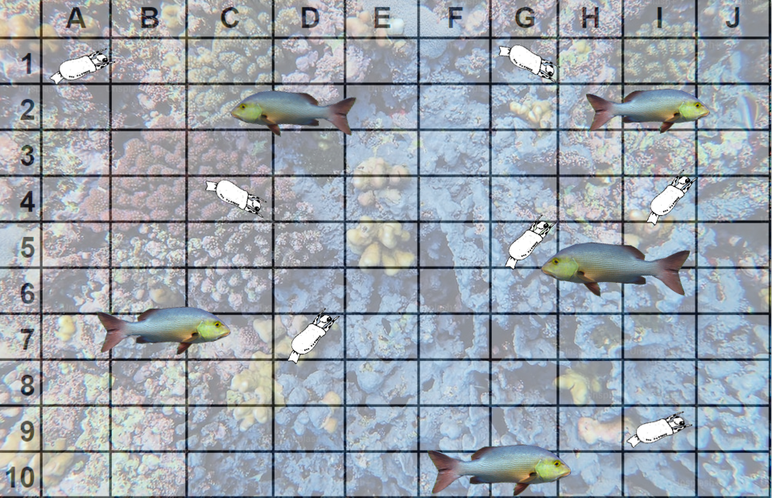

{width="70%"} 

## The Lotka-Volterre Predator-Prey Model

The Lotka-Volterra model mathematically describes the ecological interaction between predator and prey populations. Specifically, the model describes how the size of the prey population directly influences the size of the predator population, and vice versa. 

The best way to understand this model is to visualize how the population sizes of two species (y-axes) interact across time (x-axis). 

{width="70%"}


The figure above depicts a real example of the Lotka-Volterra Predator Prey relationship. Note that there are two y-axes with different scales for the population size of the predator and prey populations. 

The dynamic between the two populations is relatively intuitive:

* As prey population (Hares) increase, predator population (Lynx) increase in response. However, the predator population growth curve lags (in time) behind that of the prey population. 
* As a result of increasing predation (from increasing numbers of predators), the prey population size peaks and then begins to fall. 
* The decrease in prey availability results in the predator population growth curve falling, again mirroring the trajectory of the prey population growth curve. 
* As the predator population decreases in size, the prey population is able to increase once again, starting the cycle over. This cyclical rise and fall of the two populations is the fundamental prediction of the Lotka-Volterra Predator Prey model.  

## Shiny pollards (predator) and blade-tailed caminalcules (prey)

When formulating a conservation plan, it's important to consider the effect that predators have on the species in decline. The Caminalcule Research Team has identified the shiny pollard as the blade-tailed caminalcule's primary predator in coral reef ecosystem. Not unlike the coral grouper shown in the Blue Planet video featured in CCP1, the shiny pollard is a species of fish  that feeds on smaller fish and invertebrate prey. Ecologists in the Caminalcule Research Team are concerned that predation by shiny pollards could exacerbate the blade-tail's decline, possibly putting them at risk of extinction. 

Your research team has been asked to model the effect of shiny pollard population size on blade-tailed caminalcule population size. In the following exercise, you will assess whether the interaction between these two species produces a pattern similar to what we would expect under the Lotka-Volterra Predator Prey model. In Species Survival Portfolio Part 3, your team will run another simulation to show how your novel beneficial trait could relieve some of the predation pressure currently suppressing the blade-tail's population size.

### The model:

This simulation models how a blade-tail population is affected by shiny pollard predation and follows these rules: 

* The simulation takes place in a 10 by 10 grid of imaginary coral reef habitat which has a carrying capacity of 100 caminalcules and 75 pollards, roughly equivalent to the carrying capacity of one hectare of real coral reef habitat. 
* The simulation begins by placing 5 blade-tails and 5 shiny pollards in random locations in the 10 by 10 grid. When a pollard is placed in a grid cell adjacent to a caminalcule, the pollard eats one caminalcule, simulating a predation event. 
* For every caminalcule eaten, one pollard is born. But in each generation, 1/3 of the original pollard population dies. Pollards are known to have short lifespans and relatively high death rates, since not all individuals become effective predators. 
* On average, caminalcules produce 3 offspring that survive their first year, so the caminalcule population that survives predation triples after each generation. 

### Instructions:

Set the simulation parameters to the following values:

* initial caminalcule population = 5 
* initial pollard population = 5
* caminalcule population multiplier = 3
* number of generation = 50 
* capture probability = 1 

Run the simulation and transfer the simulated data into a spreadsheet (google sheets or excel) with three columns: Generation, Caminalcule Population Size, and Pollard Population Size. Create a line graph to visualize these data and evaluate whether the simulation produced a pattern similar to what is expected under the Lotka-Volterra model. Write a brief paragraph describing your findings. 


```{r PredatorPreySim, echo=FALSE}
library(shiny)

ui <- fluidPage(
  titlePanel("Caminalcule and Pollard Simulation"),
  mainPanel(
    numericInput("camiPop", "Initial Caminalcule Population (1-100):", 1, 1, 100),
    numericInput("pollPop", "Initial Pollard Population (1-75):", 1, 1, 75),
    numericInput("camiPopMultiply", "Caminalcule Population Multiplier (1-10):", 1, 1, 10),
    numericInput("numGenerations", "Number of Generations (1-100):", 1, 1, 100),
    numericInput("captureProbability", "Capture Probability (0-1):", 0.5, 0, 1, step = 0.01),
    actionButton("simulateBtn", "Simulate"),
    verbatimTextOutput("simulationOutput") # Using verbatimTextOutput to preserve newlines
  )
)

server <- function(input, output, session) {
  outputText <- eventReactive(input$simulateBtn, {
    camiPop <- isolate(input$camiPop)
    pollPop <- isolate(input$pollPop)
    camiPopMultiply <- isolate(input$camiPopMultiply)
    numGenerations <- isolate(input$numGenerations)
    captureProbability <- isolate(input$captureProbability)
    
    
    results <- c(sprintf("Gen: 0 Starting Caminalcule Pop: %d Starting Pollard Pop: %d", camiPop, pollPop))
    
    for (index in 1:numGenerations) {
      found <- 0
      biome <- matrix(FALSE, nrow = 10, ncol = 10)
      
      for (cami in 1:camiPop) {
        x <- sample(1:10, 1)
        y <- sample(1:10, 1)
        
        if (!biome[x, y]) {
          biome[x, y] <- TRUE
        } else {
          while (biome[x, y]) {
            x <- sample(1:10, 1)
            y <- sample(1:10, 1)
          }
          biome[x, y] <- TRUE
        }
      }
      
      chosenXY <- matrix(FALSE, nrow = 10, ncol = 10)
      
      for (polly in 1:pollPop) {
        x <- sample(1:10, 1)
        y <- sample(1:10, 1)
        
        while (chosenXY[x, y]) {
          x <- sample(1:10, 1)
          y <- sample(1:10, 1)
        }
        
        if (biome[x, y] && !chosenXY[x, y] && runif(1) <= captureProbability) {
          camiPop <- camiPop - 1
          found <- found + 1
          chosenXY[x, y] <- TRUE
        } else {
          chosenXY[x, y] <- TRUE
        }
      }
      
      camiPop <- camiPop * camiPopMultiply
      if (camiPop < 1) camiPop <- 1
      if (camiPop > 100) camiPop <- 100
      
      lostPop <- floor(pollPop / 3)
      pollPop <- pollPop - lostPop
      pollPop <- pollPop + found + 1
      
      if (pollPop > 75) pollPop <- 75
      if (pollPop < 1) pollPop <- 1
      
      result_string <- sprintf("Gen: %d Ending Caminalcule Pop: %d Ending Pollard Pop: %d || found: %d", index, camiPop, pollPop, found)
      results <- c(results, result_string, "\n")
    }
    
    results <- c(results, "Simulation ended after reaching specified number of generations.")
    return(results)
  })
  
  output$simulationOutput <- renderPrint({
    outputText()
  })
}

printBiome <- function(biome, chosenXY) {
  result <- c("Printing location array of Caminalcule locations, 1 = occupied, 0 = unoccupied, X = found")
  for (i in 1:10) {
    row <- c()
    for (j in 1:10) {
      if (biome[i, j] && !chosenXY[i, j]) {
        row <- c(row, "1")
      } else if (biome[i, j] && chosenXY[i, j]) {
        row <- c(row, "X")
      } else {
        row <- c(row, "0")
      }
    }
    result <- c(result, paste(row, collapse = "  "))  # Concatenate row elements with double space
  }
  result <- paste(result, collapse = "\n")  # Join rows with newline character
  return(result)
}

shinyApp(ui, server)
```
